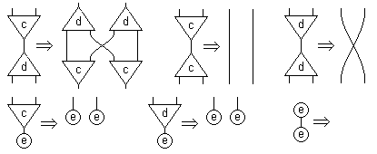

# Lamping's Abstract Algorithm

A cleaned up adaptation of [Lamping's abstract algorithm](http://dl.acm.org/citation.cfm?id=96711). It evaluates functions optimally by encoding a λ-term as ([symmetric](https://scholar.google.com.br/scholar?q=symmetric+interaction+combinators&hl=en&as_sdt=0&as_vis=1&oi=scholart&sa=X&ved=0ahUKEwjNgZbO7aTVAhUEkZAKHYyTAFgQgQMIJjAA)) [interaction combinators](http://www.sciencedirect.com/science/article/pii/S0890540197926432), normalizing the resulting graph, and decoding it back. It asymptotically beats all usual evaluators of functional programs, including Haskell's GHC, Scheme compilers, Google's V8 and so on. Moreover, it is capable of automatically exploiting any inherent parallelizability of your program, since interaction nets are a naturally concurrent model of computation. This implementation consists of two files, [a 121-loc reducer](src/interaction-combinators.js) for interaction combinators and [a 71-loc conversor](https://github.com/MaiaVictor/abstract-algorithm/blob/master/src/lambda-encoder.js) of λ-terms to and from those. It isn't parallel, but is completely lazy: it doesn't perform any work that won't influence on the normal form. There is an inherent tradeoff between those.



## Usage

1. Install

    ```bash
    npm install abstract-algorithm
    ```

2. Use

    ```javascript
    const algo = require("abstract-algorithm");

    // church-encoded exponentiation of 2^2
    const term = `
      two: s.z.(s (s z))
      (two two)
    `;

    // evaluates optimally
    console.log(algo(term));
    ```

## Bla bla bla

Crappy handwritten examples:

- [Numbers](images/handwritten_example.jpg?raw=true)

- [Pairs](images/pairs_on_inets.jpg?raw=true)

- [Either](images/either_on_inets.jpg?raw=true)

[Here](src/example.js) is a working example on how to use this lib to reduce untyped λ-terms. [Here](src/fast-reducer.js) is an inlined reducer (less pretty, but faster and with GC - the exported lib actually uses it), and [here](stuff/wasmReducer.js) is a poor attempt at making a WASM reducer (tip: it is not any faster, which is weird, because the [C](stuff/ic.c) version is 10x faster than the JS one). [Here](https://github.com/MaiaVictor/parallel_lambda_computer_tests) is an attempt to flatten the graph-reduction algorithm to a linear automata, in such a way that it could, in theory, be implemented as a massivelly parallel ASIC where each 128-bit memory cell is actually a nano-CPU capable of updating its state by looking at its neighbors, in such a way that it causes the emergent global behavior of the memory to converge to the normal form of the initial graph.

Note this only works with [stratified terms](https://www.reddit.com/r/haskell/comments/6phxvb/cleaned_up_implementation_of_lampings_abstract/dkq57yx/?context=1), which roughly means that the algorithm breaks when you have duplications inside of duplications. To make it work with arbitrary terms, you'd need to augment the system with a complex machinery known as oracle. There are many ways to do it, but all of them ruin the performance. I personally prefer to call non-stratified terms defective and ignore them. It is not hard to avoid those terms, you just have to be cautious about the implicit duplication of arguments performed by beta-reduction (which is the root of all evil). Note that the subset of oracle-free terms [is still Turing complete](https://github.com/MaiaVictor/articles/tree/master/0000-oracle-free-terms-are-turing-complete).
